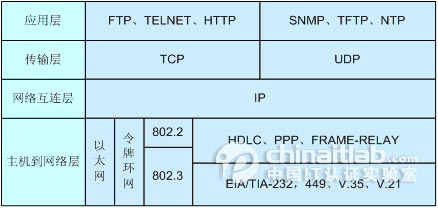

##WebSocket

>WebSocket protocol 是HTML5一种新的协议。它实现了浏览器与服务器全双工通信(full-duplex)。

##OSI、TCP/IP、TCP、UDP、HTTP、Socket
* OSI（Open System Interconnection）参考模型是一个用于计算机或通信系统间互联的标准体系，一般称为OSI参考模型或七层模型。它是一个七层的、抽象的模型。

* TCP/IP又名网络通讯协议。TCP/IP协议不是TCP和IP这两个协议的合称，而是指因特网整个TCP/IP协议族。TCP/IP通讯协议采用了4层的层级结构，每一层都呼叫它的下一层所提供的网络来完成自己的需求。

* TCP（Transmission Control Protocol 传输控制协议）是面向连接的协议,建立TCP需要三次握手才能建立，而断开连接则需要四次握手。

* UDP(User Datagram Protocol 用户数据报协议)是一种无连接的协议,提供简单的不可靠信息传送服务。

* HTTP(HyperText Transfer Protocol 超文本传输协议)是一种基于tcp协议的无状态短链接协议，属于应用层。HTTP协议采用了请求/响应模型。

* Socket是在程序层面对tcp和udp的抽象,是一组编程接口。

##WebSocket三次握手
* 第一次 客户端向服务端发送请求

	>ET /chat HTTP/1.1
	Host: server.example.com
	Upgrade: websocket
	Connection: Upgrade
	Sec-WebSocket-Key: x3JJHMbDL1EzLkh9GBhXDw==
	Sec-WebSocket-Protocol: chat, superchat
	Sec-WebSocket-Version: 13
	Origin: http://example.com

* 第二次 服务端回复客户端请求

	>HTTP/1.1 101 Switching Protocols
	Upgrade: websocket
	Connection: Upgrade
	Sec-WebSocket-Accept: HSmrc0sMlYUkAGmm5OPpG2HaGWk=

* 第三次 消息发送接收

	>客户端和服务端发送非握手文本消息时，消息以utf-8编码，并以0x00开头，0xFF结尾。

##[WebSocket API](https://html.spec.whatwg.org/multipage/comms.html#network)

	enum BinaryType { "blob", "arraybuffer" };
	[Constructor(DOMString url, optional (DOMString or sequence<DOMString>)
		protocols), Exposed=(Window,Worker)]
	interface WebSocket : EventTarget {
	  readonly attribute DOMString url;

	  // ready state
	  const unsigned short CONNECTING = 0;
	  const unsigned short OPEN = 1;
	  const unsigned short CLOSING = 2;
	  const unsigned short CLOSED = 3;
	  readonly attribute unsigned short readyState;
	  readonly attribute unsigned long bufferedAmount;

	  // networking
	  attribute EventHandler onopen;
	  attribute EventHandler onerror;
	  attribute EventHandler onclose;
	  readonly attribute DOMString extensions;
	  readonly attribute DOMString protocol;
	  void close([Clamp] optional unsigned short code, optional USVString reason);

	  // messaging
	  attribute EventHandler onmessage;
	  attribute BinaryType binaryType;
	  void send(USVString data);
	  void send(Blob data);
	  void send(ArrayBuffer data);
	  void send(ArrayBufferView data);
	};

##html5 WebSocket客户端使用
	
	var ws = new WebSocket(“ws://echo.websocket.org”);
	ws.onopen = function(){ws.send(“Test!”); };
	ws.onmessage = function(evt){console.log(evt.data);ws.close();};
	ws.onclose = function(evt){console.log(“WebSocketClosed!”);};
	ws.onerror = function(evt){console.log(“WebSocketError!”);};